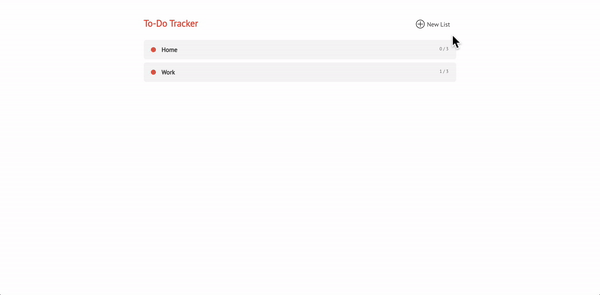

# To-Do App developed using Express.js and Pug templating

# What?
This is a to-do application developed using: 
- `Express.js` for setting up the server-side logic of the application.
- `Pug` used as a templating language of choice.

# Why?
This To-Do Application is a part of the [Launch School's](https://launchschool.com/) Networked Applications with JavaScript course. While most of the `CSS` and `Pug` files are provided as course materials for a student convenience, the server-side code is written by myself and showcases the ability to use Express for work.

# Installation
- Open up the terminal application of your choice and navigate to the directory where you wish to save the program files.
- Type in `git clone https://github.com/dmytronayda/todos-js175.git` command and hit `Enter` to download the To-do Project files on your local machine. 
- Navigate to the project folder `cd todos-js175`.
- Type in `npm prune` to install the missing dependencies required to run the project locally.
- Type in `npm start` to start the local server and console logging.
- Navigate to URL [http://localhost:3000/](http://localhost:3000/) to start using the application.